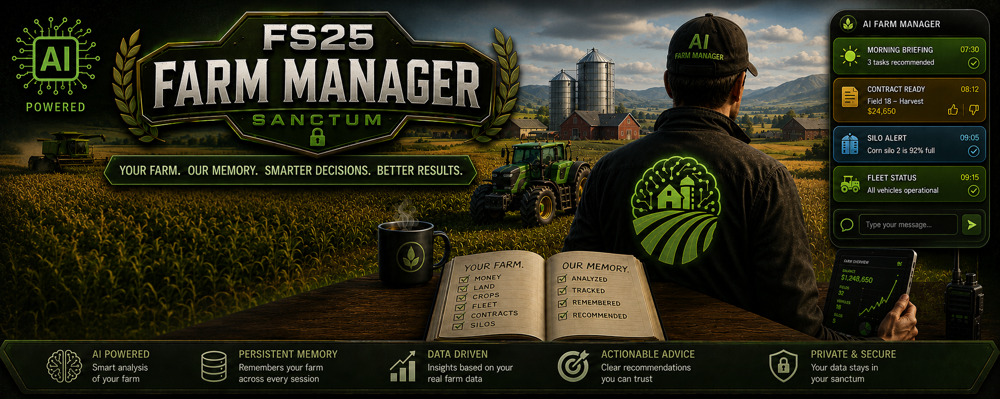

# FS25 Farm Manager

*Reads your save, remembers your farm, tells you what matters — read-only, always.*

An AI farm manager for **one** Farming Simulator 25 savegame. It reads your save, remembers
your farm across sessions, and — with the mod installed — becomes an always-on companion
(it introduces itself as **Cyrus**) that puts messages on your screen while you play **and
reads your answers back**: a card can carry a yes/no, a choice, or a reply box, and your
click comes straight back to the manager.

It is **read-only against your game**. It never writes to your savegame — not once, not ever.

```
┌──────┬──────────────────────────────┐
│ sun  │ MORNING BRIEFING       07:30 │
│      │ 3 tasks recommended          │
├──────┼──────────────────────────────┤
│ silo │ SILO ALERT             09:05 │
│      │ Corn silo 2 is 92% full      │
└──────┴──────────────────────────────┘
```

## What's in the box

```
fs25-farm-manager/
├── README.md                     this file
├── .claude/skills/
│   ├── fs25-farm-manager/        the manager — your AI's farm knowledge
│   │   ├── SKILL.md                what it does and when
│   │   ├── scripts/                readers for your save, the notifier, the reply reader,
│   │   │                             the event watcher, and helper scripts
│   │   ├── references/             crop timing, time mechanics, workflows
│   │   └── templates/              used once, to set up your farm's memory
│   ├── farm-briefing/            /farm-briefing — start a session
│   ├── farm-closeout/            /farm-closeout — end one
│   └── farm-status/              /farm-status   — a quick look, writes nothing
└── mod/
    ├── FS25_AIFarmManager25.zip  the on-screen notification + reply mod
    └── source/                     the mod's source, if you want to read it
```

The three small skills are shortcuts into the manager; it does the work.

## How the skill and mod work together

The skill and the mod are two halves of one **two-way** loop — the skill decides, the mod
displays, and your answer comes back:

```
Claude Code (the skill)                     FS25 (the mod)
   reads your save
   forms a recommendation
   writes ───────────────────► modSettings/FS25_AIFarmManager25/notify.xml
                                              reads it, draws a card (maybe with
                                              👍/👎, a choice, or a reply box),
                                              deletes the file to prove delivery
                                  ◄────────── you click or type an answer;
   read_replies.py ingests it     replies.xml  the mod appends it here
   into the sanctum ledger
```

You don't watch for that reply by hand. The manager runs an **event-driven** loop: at the
start of a session it arms `wait_for_event.py` under a persistent Monitor, which sits idle at
~zero cost and wakes the manager only when the game writes a reply or writes your save; at
closeout it disarms it. (It **polls** the two files — inotify can't see Windows-side writes
from WSL — and never touches your save.)

Install both to get the full experience: the skill is what reads and remembers your farm,
the mod is what turns its notifications into a card on your screen and carries your answer
back. The skill works without the mod — you just won't see on-screen cards — but the mod
alone has nothing to read. See **Install** below for both, and **On-screen notifications**
for how the bridge files work.

## Install

**You need:** [Claude Code](https://claude.com/claude-code), Python 3, and FS25.
No Python packages to install — the skill uses only the standard library.

### 1. The skill

Copy the `.claude` folder into the project folder you want to run Claude Code from:

```
your-farm-folder/
└── .claude/skills/
    ├── fs25-farm-manager/
    ├── farm-briefing/
    ├── farm-closeout/
    └── farm-status/
```

If you already have a `.claude` folder, copy the four folders inside `skills/` into your
`.claude/skills/`. To use it from any folder instead, copy them to `~/.claude/skills/`.

### 2. The mod (optional — only for on-screen notifications)

**Get the mod:** download `FS25_AIFarmManager25.zip` from
[KingMods](https://www.kingmods.net/en/fs25/mods/79933/ai-farm-manager) or the
[GitHub releases](https://github.com/Hidden-History/FS25-AI-Farm-Manager/releases).

Copy `mod/FS25_AIFarmManager25.zip` into your FS25 mods folder:

| | |
|---|---|
| Windows | `Documents\My Games\FarmingSimulator2025\mods\` |
| macOS | `~/Library/Application Support/FarmingSimulator2025/mods/` |

Start FS25 and tick **AI Farm Manager 25** in the mod list.

The mod is client-side only and safe in multiplayer. It works inside one folder,
`modSettings/FS25_AIFarmManager25/`: it reads `notify.xml` (the card to show), appends your
answers to `replies.xml`, and keeps the on-screen stack in `state.xml` so cards survive a
restart. It touches nothing else — never your savegame.

### 3. Set up your farm

Start Claude Code in your farm folder and say:

> set up my farm manager

It will find your savegame, ask you a handful of questions about how you want to play, and
write your farm's memory into a `sanctum/` folder. That takes a few minutes and happens once.

## Use

Just talk to it — or use a slash command.

| Say | Or type | You get |
|---|---|---|
| "briefing" | `/farm-briefing` | What changed since last time, and what's worth doing today |
| "status" | `/farm-status` | A quick look at the save. Writes nothing |
| "close out" | `/farm-closeout` | Writes the session up so the next one starts informed |
| "what should I buy?" | | Seed/fertilizer timing, gear you don't own, the used market — with prices |
| "what's oat worth?" | | Prices, and when they peak |

Everything else is a conversation. Ask it anything about your farm.

## Your farm's memory

Setup creates a `sanctum/` folder next to your `.claude` folder. That's your farm's memory —
its decisions, its history, its house rules. It's plain Markdown; read it, edit it, keep it in
git if you like.

**It's yours and it stays local.** Nothing here sends your save anywhere.

## On-screen notifications

Once the mod is installed, your AI can put a card on your screen while you play:

```bash
python3 .claude/skills/fs25-farm-manager/scripts/notify_farm_manager.py \
    -s warn -t "Silo Alert" -i silo "Corn silo 2 is 92% full"
```

`-s` sets the colour: `ok` green · `info` blue · `warn` amber · `critical` red.
`-i` picks the glyph — `--help` lists them all (briefing, contract, silo, fleet, finances,
crop, weather, harvest, field, report, equipment, fuel, building, supply, schedule, profit,
worker, dealer, soil, season, plus generic leaf/alert/check, and the interaction glyphs the
mod draws on actionable cards).

Recent cards stack, so a new one arrives with its context rather than replacing it. Times are
**farm time**, not your PC's clock.

**Exit codes matter:** `0` the mod showed it · `2` nothing read it (mod not installed or game
not running) · `1` couldn't work out where to write. A `2` is never a success.

### Asking a question, not just telling you something

A card can also ask. Give it a stable `--id` and one or more affordances, and the manager
gets your answer back:

```bash
python3 .claude/skills/fs25-farm-manager/scripts/notify_farm_manager.py \
    --id ctr-field18-0812 -s info -t "Contract Ready" \
    --action yesno "Field 18 harvest — $24,650. Take it?"
```

`--action yesno` draws 👍/👎, `--action ack` a single check, `--action text` a reply box, and
`--choice value:Label` (repeatable) a set of options. Every actionable card also carries a
**✕** to dismiss. You answer with the mouse whenever the game's shared cursor is up (raised by
AutoDrive's middle-mouse, Courseplay's right-mouse, or any cursor mod — this mod reads that
shared cursor, it doesn't own one). Your click is appended to
`modSettings/FS25_AIFarmManager25/replies.xml`; `read_replies.py` ingests it, deduped by
`(id, action)` so a double-click can't double-count.

**Ctrl+Period** toggles the overlay between its two modes: **on** (default) is a persistent
panel — header, cards and reply box stay up and cards don't expire until you dismiss or answer
them; **off** is the classic transient pop-up where each card fades after its time. Un-dismissed
cards survive a restart (the mod mirrors the stack to `state.xml`).

If the interactive layer ever fails, the mod doesn't go quiet — it falls back to a plain
one-way card, and if even that can't draw, to the game's own notification. **Interactive →
one-way → native**, each less capable but still delivering the message.

Move or restyle the panel without reinstalling — create
`modSettings/FS25_AIFarmManager25/settings.xml`:

```xml
<farmManager25>
    <hud anchorX="0.985" anchorY="0.86" widthPx="330" textSizePx="13" bgAlpha="0.92" />
    <timing minMs="8000" maxMs="60000" msPerChar="70" />
</farmManager25>
```

## How it behaves, and why

This exists because a farm manager that invents numbers is worse than none.

- **It reads, it doesn't guess.** Cash, land, fleet, prices, crop states, contracts — all
  come from your save. When something genuinely isn't on disk, it says so and asks.
- **It never writes to your savegame.** All its own notes go in `sanctum/`.
- **An empty answer is never reported as a fact.** "No land found" and "you own no land" are
  different claims, and the scripts keep them different — a bug that once had it confidently
  report a farm owned nothing when it owned 18 parcels.
- **It tells you when it was wrong.** If a plan didn't work, it says so.

## Troubleshooting

**"It can't find my savegame."** Tell it the path. On WSL, use the `/mnt/c/...` form.

**Notifications return exit 2.** The mod isn't installed, isn't enabled, or the game isn't
running. The script prints what it actually checked — read that rather than guessing.

**The notification is a plain grey box.** The panel failed to draw and fell back to the
game's own notification, so you still got the message. Check `log.txt` for
`FarmManager25` — it will say exactly why.

**Everything looks wrong after a game update.** Ask it to re-verify. The scripts report their
own trust status at runtime; that's the signal to read.
